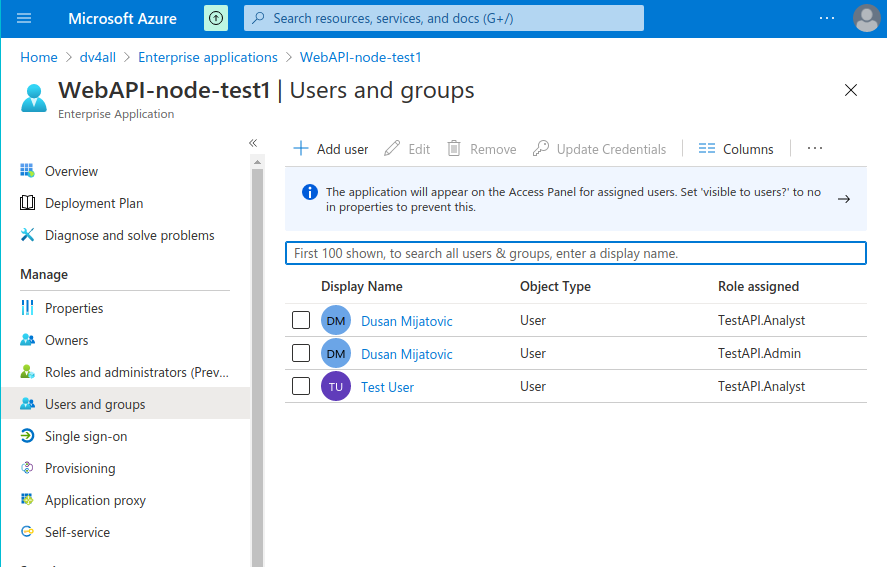

# Azure AD MSAL example

This project is used to test MSAL authentication and authorization. All msal code is in msal folder. For redirect there is useRedirectLogin hook. The redirect and pop solutions are in different branches. My prefference is to use redirect solution.

## MSAL basics

Here we describe what we have learned from this example.

### Initalization

By default, MSAL is configured to set the redirect URI to the current page that it is running on. If you would like to receive the authorization code on a different page than the one running MSAL, you can set this in the configuration. More [info here](https://github.com/AzureAD/microsoft-authentication-library-for-js/blob/dev/lib/msal-browser/docs/initialization.md)

```javascript
const msalConfig = {
  auth: {
    clientId: "your_client_id",
    authority: "https://login.microsoftonline.com/{your_tenant_id}",
    redirectUri: "https://contoso.com",
  },
};
```

### Scopes

The scopes used in config need to be defined in Azure AD. On the api side with passport these scopes only need to be defined in config (and only use short name).

When performing token request using silentToken method, the account information is required. The account information is part of login process. In the login request some basic scopes can be asked like openid, profile, email etc. Even without these scopes some basic scopes are returned.

```javascript
// Add here scopes for access token to be used at the API endpoints.
// The scopes to use need to be defined in
// Azure AD->App Registrations->Expose an API
// If the scope is not defined token request will error with the message
// about missing scope
export const tokenRequest = {
  //add account info here after login
  account: undefined,
  // scopes taken from Azure AD for API
  //"api://0bb2e832-fe23-44d2-920e-120caf021a74/admin.write",
  //"api://0bb2e832-fe23-44d2-920e-120caf021a74/all.read"
  //"api://0bb2e832-fe23-44d2-920e-120caf021a74/api.test.scope"
  scopes: ["api://0bb2e832-fe23-44d2-920e-120caf021a74/api.test.scope"],
};
```

### Limit user access

If the user exists in the tenant it will be allowed access to application. To limit access to only users assigned to application set flag to yes in Enterprise applications on Azure AD.

Azure AD -> Enterprise applications -> AppName -> Properties 'User Assignment required' = Yes!

For assigning the roles premium P2 version is required, as far as I can find.

### Roles

Creating and assigning user roles seem to be somewhat hidden and complicated. I first though I would need premium license P2 for this. Below is the approach without P2 license. At the point I managed to have roles in the token I also had in api scopes MS Graph -> User.Read.All

- `Step 1`: edit manifest file of your app at the section appRoles. In this section add following values. Go to App registrations -> [AppName] -> Manifest. It is a json file. The values received in the token under roles array are defined in prop `value`.

```json
"appRoles": [
  {
    "allowedMemberTypes": [
      "User"
    ],
    "description": "TestAPI analyst has access to coding tool",
    "displayName": "TestAPI.Analyst",
    "id": "d1c2ade8-98f8-45fd-aa4a-6d06b947c66f",
    "isEnabled": true,
    "lang": null,
    "origin": "Application",
    "value": "Analyst"
  },
      {
    "allowedMemberTypes": [
      "User"
    ],
    "description": "TestAPI admin has access to management tool",
    "displayName": "TestAPI.Admin",
    "id": "f7f9acfc-ae0c-4d6c-b489-0a81dc1652dd",
    "isEnabled": true,
    "lang": null,
    "origin": "Application",
    "value": "admin"
  },
      {
    "allowedMemberTypes": [
      "User"
    ],
    "description": "TestAPI redacteur has access to parts of coding tool",
    "displayName": "TestAPI.Redacteur",
    "id": "1b0b93f1-c353-4407-adf6-e0f0c80a7492",
    "isEnabled": true,
    "lang": null,
    "origin": "Application",
    "value": "testapi.redacteur"
  }
]
```

- `Step 2`: assign these roles to users added to app. Go to Enterprise Apps ->[AppName]-> Users and groups. Click on add. This seem like you are adding a user but you are actually adding a combination of user and role. Therefore you will have multiple items here for one user if it has multiple roles assigned.



### Optional claims

I also used optional claims to add email and ip address. This can be done at App registration -> [App Name] -> Token configuration. The choice between ID and Access token is given. As we use info with API the info is added to Access token.
